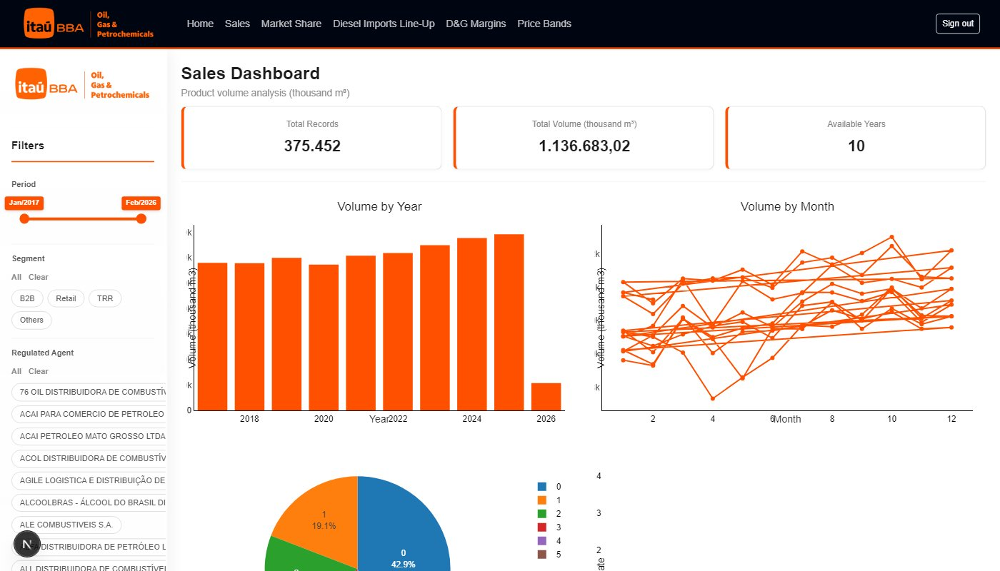
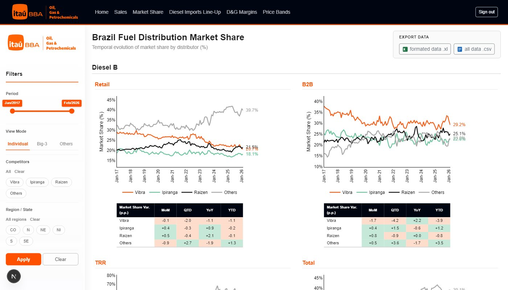
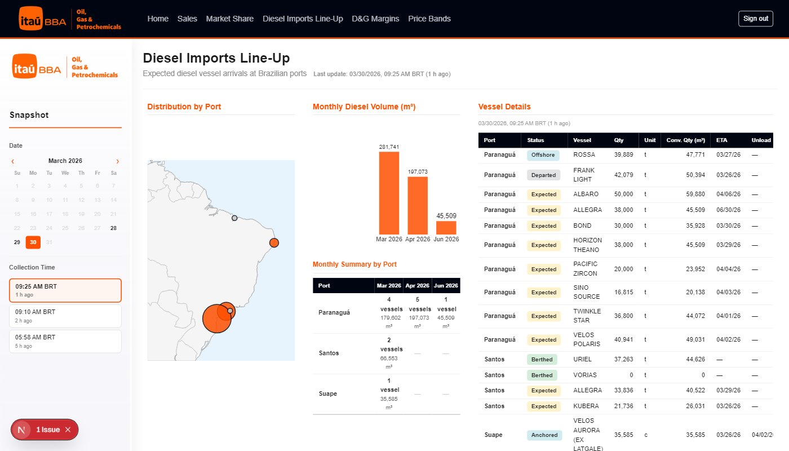
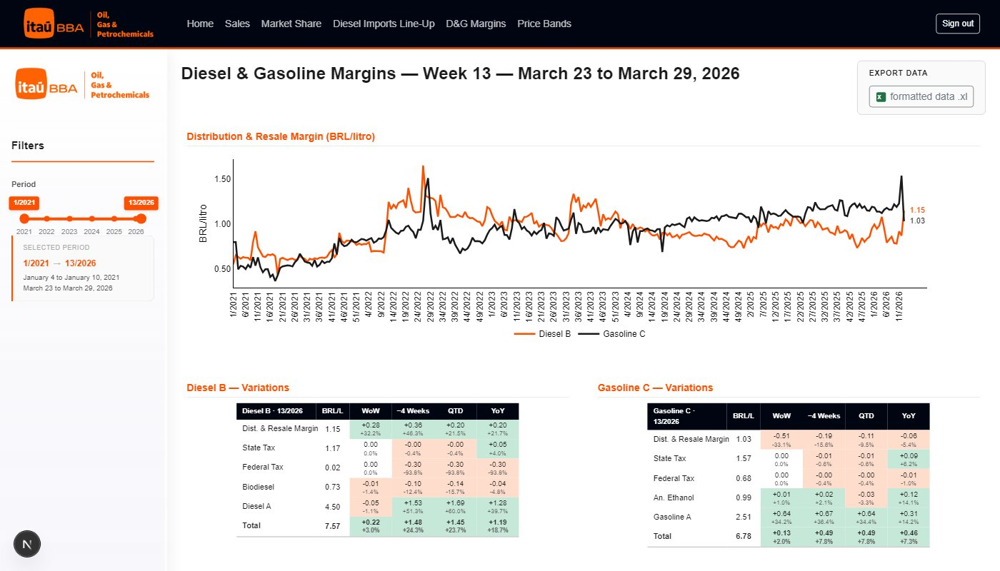
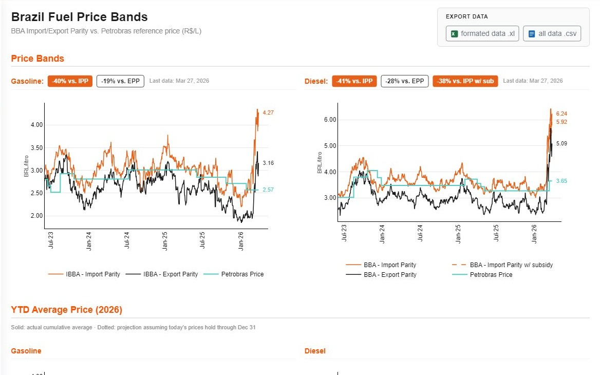

# Itau BBA Dashboard

**Multi-module analytics dashboard for the Fuel Distribution and Oil & Gas industries, built for Itau BBA.**

Real-time data visualization, automated data pipelines, Excel export, and role-based authentication — all powered by Next.js, Supabase, and Plotly.js, deployed on Vercel.

---

## Table of Contents

- [Overview](#overview)
- [Screenshots](#screenshots)
- [Architecture](#architecture)
- [Tech Stack](#tech-stack)
- [Project Structure](#project-structure)
- [Modules](#modules)
  - [Home](#home)
  - [Sales Volumes](#sales-volumes)
  - [Market Share](#market-share)
  - [Diesel Imports Line-Up](#diesel-imports-line-up)
  - [D&G Margins](#dg-margins)
  - [Price Bands](#price-bands)
  - [Market Watch](#market-watch)
- [Database Schema](#database-schema)
- [Data Pipelines (GitHub Actions)](#data-pipelines-github-actions)
  - [Vessel Monitoring](#1-vessel-monitoring)
  - [ANP Production Extraction](#2-anp-production-extraction)
  - [D&G Margins Upload](#3-dg-margins-upload)
  - [Supabase Migration Deploy](#4-supabase-migration-deploy)
- [Authentication & Roles](#authentication--roles)
- [Reusable Components](#reusable-components)
- [Supabase RPC Reference](#supabase-rpc-reference)
- [Excel Export](#excel-export)
- [Getting Started](#getting-started)
- [Deployment](#deployment)
- [Adding a New Module](#adding-a-new-module)
- [Environment Variables Reference](#environment-variables-reference)

---

## Overview

The Itau BBA Dashboard (internally codenamed **SectorData**) is an internal analytics platform that gives Itau BBA analysts immediate access to up-to-date data across the Brazilian fuel distribution and Oil & Gas sectors.

### What it does

- **Visualizes fuel distribution volumes** broken down by product, distributor, segment, region, and time period
- **Tracks market share evolution** of major fuel distributors (Vibra, Ipiranga, Raizen) and smaller players over time
- **Monitors diesel import vessels** arriving at four Brazilian ports, with ETA, discharge status, and quantity tracking
- **Breaks down fuel price composition** into its components: base fuel, biofuel, taxes, and distribution margins
- **Compares import/export parity** against Petrobras pricing for gasoline and diesel, including YTD cumulative averages
- **Provides real-time market data** for Brazilian and international stocks, indices, and commodities via a Bloomberg-style dashboard

### Key products tracked

| Product | Description |
|---------|-------------|
| Diesel B | Diesel blended with biodiesel |
| Gasoline C | Gasoline blended with anhydrous ethanol |
| Hydrous Ethanol | Stand-alone ethanol fuel |
| Otto-Cycle | Combined gasoline + ethanol equivalent |

### Key players tracked

| Player | Type |
|--------|------|
| Vibra | Big-3 distributor |
| Ipiranga | Big-3 distributor |
| Raizen | Big-3 distributor |
| Others | All remaining distributors (aggregated) |

---

## Screenshots

The Home page acts as a module directory with preview thumbnails for each dashboard:

| Sales Volumes | Market Share | Diesel Imports Line-Up |
|:-:|:-:|:-:|
|  |  |  |

| D&G Margins | Price Bands |
|:-:|:-:|
|  |  |

---

## Architecture

```
┌─────────────────────────┐
│    External Sources      │
│  ANP Portal, Port sites, │
│  Yahoo Finance API,      │
│  Excel files (manual)    │
└───────────┬─────────────┘
            │  Python 3.12 (Selenium, pandas, OCR) + Next.js API routes
            ▼
┌─────────────────────────┐
│    GitHub Actions         │
│  4 scheduled workflows   │
│  (cron: 6h / weekly /    │
│   monthly / on-push)     │
└───────────┬─────────────┘
            │  CSV commit + Supabase upsert
            ▼
┌─────────────────────────┐
│    Supabase               │
│  PostgreSQL database      │
│  25+ RPC functions        │
│  Row Level Security       │
│  Email/password auth      │
│  User roles (Admin/Client)│
└───────────┬─────────────┘
            │  supabase-js client (anon key)
            ▼
┌─────────────────────────┐
│    Next.js 16 Frontend    │
│  App Router + TypeScript  │
│  Bootstrap 5 + Plotly.js  │
│  Deployed on Vercel       │
└───────────┬─────────────┘
            │
            ▼
┌─────────────────────────┐
│    Browser (User)         │
│  Authenticated session    │
│  Role-based visibility    │
│  Interactive charts       │
│  Excel export             │
└─────────────────────────┘
```

### Key architectural decisions

- **No custom API routes for Supabase data.** All backend logic lives in PostgreSQL RPC functions, called directly from the browser via the Supabase JS client. This eliminates a Node.js API layer entirely.
- **Next.js API routes for third-party proxying.** The Market Watch module proxies Yahoo Finance requests through `/api/stocks/*` to avoid CORS issues and keep credentials server-side.
- **Client-side auth.** Supabase email/password authentication with a shared layout guard that redirects unauthenticated users to `/login`.
- **Role-based module visibility.** Admins can toggle which modules are visible to Client users via the Admin Panel page. Visibility state is stored in Supabase and loaded at session start.
- **Materialized views for performance.** Market Share queries hit pre-aggregated materialized views (`mv_ms_serie`, `mv_ms_serie_fast`) instead of scanning the full `vendas` table.
- **GitHub Actions as the data pipeline orchestrator.** Scheduled cron workflows scrape external sources, commit raw CSVs to the repo, and import data into Supabase — no separate ETL infrastructure required.

---

## Tech Stack

| Layer | Technology | Version |
|-------|-----------|---------|
| Framework | Next.js (App Router) | 16.2.1 |
| UI Library | React + React DOM | 19.2.4 |
| Language | TypeScript | 5 |
| Styling | Bootstrap | 5.3.8 |
| Charts | Plotly.js (react-plotly.js) | 3.4.0 |
| Draggable Grid | react-grid-layout | latest |
| Slider | rc-slider | 11.1.9 |
| Database & Auth | Supabase (PostgreSQL + PostgREST) | supabase-js 2.100.1 |
| Excel Export | ExcelJS + JSZip + xlsx-js-style | 4.4.0 / 3.10.1 |
| Market Data | Yahoo Finance (via Next.js proxy API) | — |
| Data Pipelines | Python (pandas, selenium, beautifulsoup4, ddddocr) | 3.12 |
| CI/CD | GitHub Actions | 4 workflows |
| Deployment | Vercel | Auto-deploy on push |

---

## Project Structure

```
dashboard_projeto/
├── .github/workflows/              # CI/CD pipelines
│   ├── navios_esperados.yml        #   Every 6h: scrape port vessel data
│   ├── extrair-anp.yml             #   Monthly 5th: ANP well production extraction
│   ├── upload-dg-margins.yml       #   Weekly Monday: D&G margins upload
│   └── supabase-deploy.yml         #   On push: deploy Supabase migrations
│
├── data/                           # Source data files (gitignored — local only)
│   ├── Liquidos_Vendas_Atual.csv   #   ~130 MB — full sales dataset
│   ├── d_g_margins.xlsx            #   Diesel & gasoline margins
│   └── price_bands.xlsx            #   Price band data
│
├── output/                         # Pipeline output (gitignored — written by GitHub Actions)
│
├── public/
│   ├── logo.png                    # Itau BBA logo
│   ├── barrel_loading.png          # Loading spinner image
│   └── previews/                   # Module preview screenshots
│
├── scripts/
│   ├── anp_auto.py                 # ANP scraper (Selenium + OCR)
│   ├── import_navios_diesel.mjs    # Node.js: CSV → Supabase importer
│   ├── upload_price_bands.py       # Price bands Excel → Supabase
│   ├── deploy_migration.mjs        # Supabase migration helper
│   └── capture-previews.mjs        # Screenshot generator for Home previews
│
├── sql/
│   └── create_price_bands.sql      # Price bands table DDL (standalone)
│
├── src/
│   ├── app/
│   │   ├── layout.tsx              # Root HTML shell (Bootstrap CSS, lang=pt-BR)
│   │   ├── globals.css             # Global styles (700+ lines)
│   │   ├── login/page.tsx          # Login page
│   │   ├── forgot-password/page.tsx
│   │   ├── reset-password/page.tsx
│   │   ├── api/stocks/             # Yahoo Finance proxy API routes
│   │   │   ├── quote/route.ts      #   Real-time quote endpoint
│   │   │   ├── history/route.ts    #   Historical price series
│   │   │   ├── search/route.ts     #   Ticker search
│   │   │   └── futures-curve/route.ts # Futures curve data
│   │   └── (dashboard)/            # Auth-guarded route group
│   │       ├── layout.tsx          #   Session check → redirect to /login
│   │       ├── page.tsx            #   Root redirect → /home
│   │       ├── home/page.tsx       #   Home — module directory
│   │       ├── sales-volumes/page.tsx  # Sales Volumes dashboard
│   │       ├── market-share/page.tsx
│   │       ├── navios-diesel/page.tsx
│   │       ├── diesel-gasoline-margins/page.tsx
│   │       ├── price-bands/page.tsx
│   │       ├── stocks/page.tsx     #   Market Watch (Bloomberg-style)
│   │       ├── profile/page.tsx    #   User profile editor
│   │       ├── admin-panel/page.tsx   #   Admin-only: roles + module visibility
│   │       └── template-module/page.tsx  # Starter template for new modules
│   │
│   ├── components/                 # Reusable UI components
│   │   ├── NavBar.tsx              #   Top nav with module links + user menu
│   │   ├── PlotlyChart.tsx         #   Plotly.js wrapper
│   │   ├── PeriodSlider.tsx        #   Date range slider (rc-slider)
│   │   ├── CheckList.tsx           #   Multi-select checkbox group
│   │   ├── RegionStateFilter.tsx   #   Cascading region → state filter
│   │   ├── SearchableMultiSelect.tsx #  Searchable dropdown multi-select
│   │   └── stocks/                 #   Market Watch sub-components
│   │       ├── StockChart.tsx      #     Price/volume chart (Plotly)
│   │       ├── ComparisonChart.tsx #     Multi-asset comparison chart
│   │       ├── MarketOverview.tsx  #     Index/commodity snapshot table
│   │       ├── StockSearch.tsx     #     Ticker search input
│   │       └── FuturesCurveChart.tsx #   Brent futures curve
│   │
│   ├── context/
│   │   └── UserProfileContext.tsx  # React context: profile + moduleVisibility
│   │
│   ├── hooks/
│   │   ├── useStockQuote.ts        # Real-time quote polling
│   │   ├── useStockHistory.ts      # Historical price data
│   │   ├── useStockPortfolios.ts   # Watchlist/portfolio CRUD
│   │   ├── useAutoRefresh.ts       # Configurable polling interval
│   │   ├── useModuleVisibilityGuard.ts # Redirect if module is hidden
│   │   ├── useRoleGuard.ts         # Redirect if role insufficient
│   │   └── useDebounce.ts          # Input debounce
│   │
│   ├── lib/
│   │   ├── supabaseClient.ts       # Supabase client singleton
│   │   ├── rpc.ts                  # All RPC wrappers (grouped by module)
│   │   ├── profileRpc.ts           # Profile + admin RPC wrappers
│   │   ├── filterUtils.ts          # Date helpers, REGIAO_UF_MAP, month names
│   │   ├── avatarUtils.ts          # User initials helper
│   │   └── exportExcel.ts          # Excel export for all modules
│   │
│   └── types/
│       ├── stocks.ts               # Stock/quote/portfolio type definitions
│       ├── profile.ts              # User profile + role types
│       └── plotly.js-dist-min.d.ts # Type shim for Plotly
│
├── supabase/
│   ├── config.toml                 # Supabase local dev config
│   └── migrations/                 # SQL migrations (deployed via CI)
│       ├── 20260327174919_remote_schema.sql       # Base schema (vendas + views + RPCs)
│       ├── 20260328200000_navios_diesel.sql        # Vessel tracking table + RPCs
│       ├── 20260329000000_create_d_g_margins.sql  # D&G margins table + RPCs
│       ├── 20260331000000_navios_diesel_brt.sql   # BRT timezone fix for vessel times
│       ├── 20260331000001_navios_diesel_drop_old_sigs.sql # Cleanup old function signatures
│       ├── 20260401000000_stock_portfolios.sql    # stock_portfolios table + visibility
│       ├── 20260401000001_stock_portfolio_groups.sql # Add portfolio groups column
│       └── 20260402000000_sales_volumes.sql       # Sales Volumes RPC namespace (get_sv_*)
│
├── navios_esperados.py             # Root-level vessel scraper
├── upload_dg_margins.py            # Root-level D&G margins uploader
├── requirements.txt                # Python dependencies
├── package.json                    # Node.js dependencies & scripts
├── tsconfig.json                   # TypeScript config (strict mode, path aliases)
├── next.config.ts                  # Next.js config (Turbopack)
└── .env.example                    # Environment variable template
```

---

## Modules

### Home

| | |
|---|---|
| **Route** | `/home` |
| **File** | `src/app/(dashboard)/home/page.tsx` |
| **Description** | Landing page and module directory |

The Home page serves as the gateway to all dashboard modules. It displays a responsive card grid where each card shows a preview thumbnail, title, and description. Cards expand on hover to reveal a description and an "Open" link. A "Coming Soon" placeholder card indicates modules under development. Card visibility respects the Admin-configured module visibility settings.

---

### Sales Volumes

| | |
|---|---|
| **Route** | `/sales-volumes` |
| **File** | `src/app/(dashboard)/sales-volumes/page.tsx` |
| **Description** | Absolute fuel distribution volumes (thousand m³) by distributor over time |
| **Excel Export** | Yes |

Shows fuel sales volumes broken down by distributor across the same three display modes as Market Share, but in absolute terms (thousand m³) rather than percentages.

**Three display modes:**
1. **Individual** — Each distributor (Vibra, Ipiranga, Raizen, Others) as a separate time series
2. **Big-3** — Aggregates Vibra + Ipiranga + Raizen vs. Others
3. **Others** — Drills into smaller distributors outside the Big-3

**Products:** Diesel B, Gasoline C, Hydrous Ethanol, Otto-Cycle
**Segments:** Retail, B2B, TRR (Diesel only)

**Filters:** Period, Product, Segment, Region/State, Mode

**RPC functions:** `get_sv_opcoes_filtros`, `get_ms_serie_fast`, `get_ms_serie_others`, `get_others_players`

---

### Market Share

| | |
|---|---|
| **Route** | `/market-share` |
| **File** | `src/app/(dashboard)/market-share/page.tsx` |
| **Description** | Market share evolution by distributor over time |
| **Excel Export** | Yes — multi-sheet workbook per product/segment |

Tracks how fuel distribution market share evolves month over month across major distributors.

**Three display modes:**
1. **Individual** — Shows each distributor's market share as a separate time series
2. **Big-3** — Aggregates Vibra + Ipiranga + Raizen vs. Others
3. **Others** — Drills into the smaller distributors outside the Big-3

**Products:** Diesel B, Gasoline C, Hydrous Ethanol, Otto-Cycle
**Segments:** Retail, B2B, TRR (Diesel only)

**Performance optimization:** Uses materialized views (`mv_ms_serie_fast`) and paginated RPC calls (1000-row pages) to handle large datasets efficiently.

**RPC functions:** `get_ms_opcoes_filtros`, `get_ms_serie_fast`, `get_ms_serie_others`, `get_others_players`

---

### Diesel Imports Line-Up

| | |
|---|---|
| **Route** | `/navios-diesel` |
| **File** | `src/app/(dashboard)/navios-diesel/page.tsx` |
| **Description** | Vessel scheduling and diesel import tracking by port |
| **Excel Export** | Yes |

Monitors diesel import vessels arriving at four Brazilian ports. Data is automatically refreshed every 6 hours by a GitHub Actions pipeline that scrapes port websites.

**Data displayed per vessel:**
- Port name
- Vessel name and status (expected, berthed, discharging, etc.)
- Product and quantity (tons / m3)
- ETA and discharge start/end dates
- Origin and berth number

**Features:**
- Snapshot selector — browse historical collection timestamps
- Per-port summary — total vessels and quantity aggregated by port
- Automatic data refresh indicator showing the latest collection timestamp

**RPC functions:** `get_nd_ultima_coleta`, `get_nd_coletas_distintas`, `get_nd_navios`, `get_nd_resumo_portos`

---

### D&G Margins

| | |
|---|---|
| **Route** | `/diesel-gasoline-margins` |
| **File** | `src/app/(dashboard)/diesel-gasoline-margins/page.tsx` |
| **Description** | Weekly fuel price composition breakdown (R$/litro) |
| **Excel Export** | Yes |

Breaks down the retail price of Diesel B and Gasoline C into their constituent components, displayed as a horizontal stacked bar chart over weekly intervals.

**Price components:**
| Component | Diesel B | Gasoline C |
|-----------|----------|------------|
| Base fuel | Diesel A | Gasoline A |
| Biofuel component | Biodiesel | Anhydrous Ethanol |
| State tax (ICMS) | Yes | Yes |
| Federal tax (PIS/COFINS/CIDE) | Yes | Yes |
| Distribution & resale margin | Yes | Yes |

**Data updated:** Weekly on Mondays via GitHub Actions (`upload-dg-margins.yml`).

**RPC functions:** `get_dg_margins_data`, `get_dg_margins_filters`

---

### Price Bands

| | |
|---|---|
| **Route** | `/price-bands` |
| **File** | `src/app/(dashboard)/price-bands/page.tsx` |
| **Description** | Import/export parity vs. Petrobras pricing |
| **Excel Export** | Yes |

Two sections:

**1. Price Bands** — Daily time-series comparing BBA-calculated import and export parity prices against Petrobras' official pricing for gasoline and diesel.

**2. YTD Average Price** — Cumulative year-to-date average for each price series, with:
- Year selector (current year, -1, -2)
- Solid line for actual cumulative averages
- Dashed projection line extending to Dec 31 (assuming constant last observed price)
- End-of-year projected value annotations
- Petrobras tooltip showing percentage spread vs. IPP and EPP cumulative averages

**Metrics per product:**
- BBA import parity (IBBA for gasoline, BBA for diesel)
- BBA import parity with subsidy (diesel only)
- BBA export parity
- Petrobras price

**RPC functions:** `get_price_bands_data`

---

### Market Watch

| | |
|---|---|
| **Route** | `/stocks` |
| **File** | `src/app/(dashboard)/stocks/page.tsx` |
| **Description** | Bloomberg-style real-time market dashboard |
| **Excel Export** | No |

A real-time financial market dashboard with a draggable, resizable card grid layout. Data is fetched from Yahoo Finance via Next.js proxy API routes (`/api/stocks/*`).

**Cards available:**
- **Market Overview** — Snapshot table of key indices and commodities (Ibovespa, S&P 500, Brent, USD/BRL, etc.) with live price and % change
- **Chart** — Interactive price + volume chart for any ticker. Supports multiple time ranges and chart modes (line / candlestick)
- **Compare Assets** — Multi-asset normalized return comparison chart
- **Portfolio / Watchlist** — Custom watchlist with real-time quotes, day high/low, volume, and price flash on updates
- **Brent Futures Curve** — Forward curve visualization for Brent crude futures

**Features:**
- Dark / light theme toggle (persisted in localStorage)
- Draggable and resizable card grid (react-grid-layout)
- Auto-refresh with configurable interval
- B3 ticker auto-detection (PETR4, VALE3 → appends `.SA` for Yahoo Finance)
- Bloomberg-style price flash animation when values update
- Per-user portfolio/watchlist persistence via Supabase (`stock_portfolios` table)

**Data source:** Yahoo Finance, proxied through Next.js API routes to avoid CORS and expose only safe fields.

---

## Database Schema

All tables use Row Level Security (RLS) — only authenticated users can `SELECT`. All data access from the frontend goes through RPC functions (no direct table queries).

### Tables

#### `vendas` — Fuel Sales

The core table with all historical fuel sales data.

| Column | Type | Description |
|--------|------|-------------|
| `id` | bigint (PK) | Auto-generated |
| `ano` | bigint | Year |
| `mes` | bigint | Month |
| `agente_regulado` | text | Distributor name |
| `nome_produto` | text | Product name (Diesel B, Gasolina C, etc.) |
| `regiao_destinatario` | text | Destination region (Norte, Nordeste, etc.) |
| `uf_destino` | text | Destination state (SP, RJ, etc.) |
| `mercado_destinatario` | text | Market type |
| `quantidade_produto` | double precision | Volume sold |
| `classificacao` | text | Agent classification (Individual, Big-3, Others) |
| `date` | date | Reference date |
| `segmento` | text | Segment (B2B, Retail, TRR, Outros) |

**Indexes:** 13 indexes covering all filterable columns and composite queries.

#### `navios_diesel` — Vessel Tracking

Real-time diesel import vessel data, refreshed every 6 hours.

| Column | Type | Description |
|--------|------|-------------|
| `id` | bigint (PK) | Auto-generated |
| `collected_at` | timestamptz | Snapshot timestamp (BRT) |
| `porto` | text | Port name |
| `status` | text | Vessel status |
| `navio` | text | Vessel name |
| `produto` | text | Product (default: "Oleo Diesel") |
| `quantidade` | double precision | Original quantity |
| `unidade` | text | Unit of measure |
| `quantidade_convertida` | double precision | Quantity in standard units |
| `eta` | timestamptz | Estimated time of arrival |
| `inicio_descarga` | timestamptz | Discharge start |
| `fim_descarga` | timestamptz | Discharge end |
| `origem` | text | Origin |
| `berco` | text | Berth number |

**Unique constraint:** `(collected_at, porto, navio)` — prevents duplicate vessel entries per snapshot.

#### `d_g_margins` — Fuel Price Composition

Weekly fuel price breakdown into components.

| Column | Type | Description |
|--------|------|-------------|
| `id` | bigint (PK) | Auto-generated |
| `fuel_type` | text | "Diesel B" or "Gasoline C" |
| `week` | text | Week/year format (e.g., "13/2026") |
| `distribution_and_resale_margin` | numeric | R$/litro |
| `state_tax` | numeric | ICMS (R$/litro) |
| `federal_tax` | numeric | PIS/COFINS/CIDE (R$/litro) |
| `biofuel_component` | numeric | Biodiesel or Anhydrous Ethanol (R$/litro) |
| `base_fuel` | numeric | Diesel A or Gasoline A (R$/litro) |
| `total` | numeric | Total retail price (R$/litro) |

**Unique constraint:** `(fuel_type, week)`

#### `price_bands` — Import/Export Parity

Daily parity pricing data.

| Column | Type | Description |
|--------|------|-------------|
| `id` | bigint (PK) | Auto-generated |
| `date` | date | Reference date |
| `product` | text | "Gasoline" or "Diesel" |
| `bba_import_parity` | numeric(10,4) | BBA-calculated import parity |
| `bba_import_parity_w_subsidy` | numeric(10,4) | Import parity with subsidy (diesel only) |
| `bba_export_parity` | numeric(10,4) | BBA-calculated export parity |
| `petrobras_price` | numeric(10,4) | Official Petrobras price |

**Unique constraint:** `(product, date)`

#### `stock_portfolios` — User Watchlists

Per-user watchlists/portfolios for the Market Watch module.

| Column | Type | Description |
|--------|------|-------------|
| `id` | uuid (PK) | Auto-generated |
| `user_id` | uuid | References `auth.users(id)` |
| `name` | text | Portfolio name |
| `tickers` | text[] | Array of ticker symbols |
| `groups` | jsonb | Sub-portfolio groups (array of `{name, tickers}`) |
| `is_active` | boolean | Currently selected portfolio |
| `created_at` | timestamptz | Creation timestamp |
| `updated_at` | timestamptz | Last update timestamp |

**RLS:** Users can only read and write their own portfolios.

#### `module_visibility` — Per-Module Client Visibility

Controls which modules are visible to Client users (Admins always see all).

| Column | Type | Description |
|--------|------|-------------|
| `module_slug` | text (PK) | Module identifier (e.g., `"market-share"`) |
| `is_visible_for_clients` | boolean | Whether Clients can access this module |

### Materialized Views

| View | Purpose | Refreshed by |
|------|---------|--------------|
| `mv_ms_serie` | Monthly aggregated sales by product/segment/agent | `classificar_agentes()` function |
| `mv_ms_serie_fast` | Pre-aggregated for Individual/Big-3 modes (no agent column) | `classificar_agentes()` function |

These views dramatically speed up Market Share and Sales Volumes queries by pre-computing monthly aggregations instead of scanning the full `vendas` table on every request.

---

## Data Pipelines (GitHub Actions)

All pipelines support manual triggering via `workflow_dispatch` in addition to their scheduled runs.

### 1. Vessel Monitoring

| | |
|---|---|
| **Workflow** | `.github/workflows/navios_esperados.yml` |
| **Schedule** | Every 6 hours — 10:00, 16:00, 22:00, 04:00 UTC (07:00, 13:00, 19:00, 01:00 BRT) |
| **Scripts** | `navios_esperados.py` → `scripts/import_navios_diesel.mjs` |
| **Target table** | `navios_diesel` |

**Process:**
1. Python script scrapes 4 Brazilian port websites for diesel vessel data
2. Outputs `output/navios_diesel.csv`
3. Commits the CSV to the repository
4. Node.js script parses the CSV and upserts rows into Supabase

### 2. ANP Production Extraction

| | |
|---|---|
| **Workflow** | `.github/workflows/extrair-anp.yml` |
| **Schedule** | 5th of each month at 08:00 UTC (05:00 BRT) |
| **Script** | `scripts/anp_auto.py` |
| **Output** | `output/anp/` (CSV artifacts, 90-day retention) |

**Process:**
1. Installs Google Chrome on the runner
2. Selenium automates the ANP/CDP portal (with `ddddocr` for CAPTCHA solving)
3. Extracts well production data for the target period (defaults to 2 months ago)
4. Saves CSVs and commits to the repository

**Manual trigger inputs:**
- `periodo` — Single period (MM/YYYY)
- `periodo_de` / `periodo_ate` — Date range for batch extraction
- `ambiente` — Environment filter: Mar (offshore), Pre-Sal, Terra (onshore), or all

### 3. D&G Margins Upload

| | |
|---|---|
| **Workflow** | `.github/workflows/upload-dg-margins.yml` |
| **Schedule** | Every Monday at 10:00 UTC (07:00 BRT) |
| **Script** | `upload_dg_margins.py` |
| **Source** | `data/d_g_margins.xlsx` |
| **Target table** | `d_g_margins` |

**Process:**
1. Reads the Excel file with openpyxl
2. Parses Diesel B and Gasoline C margin components
3. Upserts rows into Supabase (unique on `fuel_type` + `week`)

### 4. Supabase Migration Deploy

| | |
|---|---|
| **Workflow** | `.github/workflows/supabase-deploy.yml` |
| **Trigger** | Push to `main` when `supabase/migrations/**` files change |

**Process:**
1. Links the Supabase CLI to the project using `SUPABASE_PROJECT_REF`
2. Marks the baseline migration as applied
3. Runs `supabase db push` to apply all pending migrations

---

## Authentication & Roles

### Auth Flow

1. User navigates to any dashboard page
2. The `(dashboard)/layout.tsx` guard calls `supabase.auth.getSession()`
3. If no session exists, the user is redirected to `/login`
4. User enters email and password → `supabase.auth.signInWithPassword()`
5. On success, the user is redirected to `/home`

### Auth Pages

| Route | File | Purpose |
|-------|------|---------|
| `/login` | `src/app/login/page.tsx` | Email + password login form |
| `/forgot-password` | `src/app/forgot-password/page.tsx` | Request a password reset email |
| `/reset-password` | `src/app/reset-password/page.tsx` | Set a new password (from recovery link) |

### User Roles

| Role | Access |
|------|--------|
| **Admin** | All modules, Admin Panel page, user role management, module visibility control |
| **Client** | Modules permitted by Admin visibility settings only |

Role is stored in the `user_profiles` table and loaded at session start via `UserProfileContext`. The `useRoleGuard` hook redirects non-Admins away from protected pages (e.g., `/admin-panel`).

### User Pages

| Route | File | Visible to |
|-------|------|------------|
| `/profile` | `src/app/(dashboard)/profile/page.tsx` | All authenticated users |
| `/admin-panel` | `src/app/(dashboard)/admin-panel/page.tsx` | Admin only |

The Admin Panel page allows Admins to:
- Toggle per-module visibility for Client users
- View all registered users and their roles
- Promote/demote users between Admin and Client roles

### Security

- All tables have RLS enabled — only `authenticated` users can `SELECT`
- RPC functions use `SECURITY DEFINER` to run with elevated privileges
- The frontend uses the anonymous (`anon`) key — it cannot bypass RLS
- If Supabase environment variables are missing, the dashboard shows a graceful "Missing configuration" message instead of crashing

---

## Reusable Components

All components are client-side (`"use client"`) and follow a controlled-component pattern (state is lifted to the parent page).

| Component | File | Description |
|-----------|------|-------------|
| **NavBar** | `src/components/NavBar.tsx` | Top navigation bar. Structured as `NAV_ENTRIES` (Home, Oil & Gas placeholder, Fuel Distribution dropdown, Market Watch). Includes a user avatar with dropdown for Profile, Admin Panel (Admin only), and Sign Out. |
| **PlotlyChart** | `src/components/PlotlyChart.tsx` | Wrapper around `react-plotly.js` that applies custom tooltip styling (rounded corners, drop shadow) and hides the mode bar. |
| **PeriodSlider** | `src/components/PeriodSlider.tsx` | Date range slider built with `rc-slider`. Displays year markers along the track. |
| **CheckList** | `src/components/CheckList.tsx` | Multi-select checkbox group with "Select All" and "Clear" quick actions. |
| **RegionStateFilter** | `src/components/RegionStateFilter.tsx` | Two-level cascading filter: select a region (Norte, Nordeste, etc.) to filter available states (UFs). Uses `REGIAO_UF_MAP` from `filterUtils.ts`. |
| **SearchableMultiSelect** | `src/components/SearchableMultiSelect.tsx` | Dropdown with a search input for filtering options, plus multi-select with checkboxes. Supports click-outside-to-close via `useRef`. |

---

## Supabase RPC Reference

All RPC wrappers live in `src/lib/rpc.ts` (grouped by module) and `src/lib/profileRpc.ts`. Each wrapper calls `supabase.rpc()` with typed parameters and returns typed data (or a safe fallback on error).

### Sales Volumes Module (4 functions)

| Function | Purpose | Parameters |
|----------|---------|------------|
| `get_sv_opcoes_filtros` | Available filter options (dates, regions, UFs, segments) | — |
| `get_ms_serie_fast` | Pre-aggregated volume time series (reused from Market Share) | product, segment, classification, date range |
| `get_ms_serie_others` | "Others" distributor breakdown by volume | product, segment, date range |
| `get_others_players` | List of distributors in the "Others" category | product, segment |

### Market Share Module (4 functions)

| Function | Purpose | Parameters |
|----------|---------|------------|
| `get_ms_opcoes_filtros` | Available filter options for market share | — |
| `get_ms_serie_fast` | Pre-aggregated market share time series | product, segment, classification, date range |
| `get_ms_serie_others` | "Others" distributor breakdown | product, segment, date range |
| `get_others_players` | List of distributors in the "Others" category | product, segment |

### Navios Diesel Module (4 functions)

| Function | Purpose | Parameters |
|----------|---------|------------|
| `get_nd_ultima_coleta` | Latest data collection timestamp | — |
| `get_nd_coletas_distintas` | All distinct collection timestamps | — |
| `get_nd_navios` | Vessel rows for a given snapshot | `p_collected_at` |
| `get_nd_resumo_portos` | Per-port summary (vessel count + totals) | `p_collected_at` |

### D&G Margins Module (2 functions)

| Function | Purpose | Parameters |
|----------|---------|------------|
| `get_dg_margins_data` | Margin rows ordered chronologically | `p_fuel_type` (optional) |
| `get_dg_margins_filters` | Distinct fuel types and sorted weeks | — |

### Price Bands Module (1 function)

| Function | Purpose | Parameters |
|----------|---------|------------|
| `get_price_bands_data` | All parity rows ordered by date | `p_product` (optional) |

### Profile & Admin (6 functions — in `profileRpc.ts`)

| Function | Purpose | Access |
|----------|---------|--------|
| `get_my_profile` | Fetch current user's profile + role | All users |
| `upsert_my_profile` | Update display name and avatar | All users |
| `get_module_visibility` | Fetch per-module visibility settings | All users |
| `set_module_visibility` | Toggle module visibility for Clients | Admin only |
| `get_all_users_with_roles` | List all registered users with roles | Admin only |
| `set_user_role` | Promote/demote a user's role | Admin only |

### Pagination

Functions returning large datasets use a `paginatedRpc()` helper that fetches data in 1,000-row pages via Supabase's `.range(offset, offset + PAGE - 1)` method, accumulating results until all rows are retrieved.

---

## Excel Export

Excel export is available in **Market Share**, **Sales Volumes**, **D&G Margins**, **Price Bands**, and **Navios Diesel** modules. The implementation lives in `src/lib/exportExcel.ts` and uses **ExcelJS** for workbook generation and **JSZip** for compression.

### Market Share Export

Generates a multi-sheet workbook with one sheet per product/segment combination:

| Product | Segments |
|---------|----------|
| Diesel B | Retail, B2B, TRR, Total |
| Gasoline C | Retail, B2B, Total |
| Hydrous Ethanol | Retail, B2B, Total |
| Otto-Cycle | Retail, B2B, Total |

Each sheet contains monthly market share percentages per distributor, with color-coded headers:

| Player | Color |
|--------|-------|
| Vibra | `#F26522` (orange) |
| Raizen | `#1A1A1A` (black) |
| Ipiranga | `#73C6A1` (green) |
| Others | `#A9A9A9` (gray) |
| Big-3 | `#FF5000` (dark orange) |

### Other Exports

- **Sales Volumes** — Same structure as Market Share but with absolute volumes (thousand m³)
- **D&G Margins** — Exports margin component breakdown by week for selected fuel type
- **Price Bands** — Exports parity pricing data by date and product
- **Navios Diesel** — Exports vessel data for the selected snapshot

---

## Getting Started

### Prerequisites

- **Node.js** 20+ (for the Next.js frontend)
- **Python** 3.12 (only needed for data pipeline scripts)
- A **Supabase** project with tables and RPC functions deployed (see [Database Schema](#database-schema))

### 1. Clone and install

```bash
git clone <repo-url>
cd dashboard_projeto/frontend-next
npm install
```

### 2. Configure environment variables

```bash
cp .env.example .env.local
```

Edit `.env.local` and fill in your Supabase credentials:

```env
NEXT_PUBLIC_SUPABASE_URL=https://your-project.supabase.co
NEXT_PUBLIC_SUPABASE_ANON_KEY=your_anon_key_here
```

You can find these values in your Supabase dashboard under **Project Settings > API**.

### 3. Deploy the database schema

Apply all migrations to your Supabase project:

```bash
npx supabase link --project-ref <your-project-ref>
npx supabase db push
```

Or manually run the SQL files from `supabase/migrations/` in the Supabase SQL Editor.

### 4. Run the dev server

```bash
npm run dev
```

Open [http://localhost:3000](http://localhost:3000). You will be redirected to `/login` if not authenticated.

### 5. Build for production

```bash
npm run build
npm start
```

### 6. (Optional) Set up Python pipelines

```bash
python -m venv venv
source venv/bin/activate   # or venv\Scripts\activate on Windows
pip install -r requirements.txt
```

---

## Deployment

### Frontend (Vercel)

The Next.js frontend auto-deploys to Vercel on every push to `main`. No additional configuration is needed beyond connecting the GitHub repository to a Vercel project.

### Database (Supabase)

Supabase migrations are automatically deployed via the `supabase-deploy.yml` GitHub Actions workflow whenever migration files under `supabase/migrations/` are modified on `main`.

### Required GitHub Actions Secrets

Configure these in your repository's **Settings > Secrets and variables > Actions**:

| Secret | Used by | Description |
|--------|---------|-------------|
| `SUPABASE_URL` | Pipelines | Supabase project URL |
| `SUPABASE_SERVICE_KEY` | Pipelines | Service role key (elevated privileges) |
| `SUPABASE_PROJECT_REF` | Migration deploy | Project reference ID |
| `SUPABASE_ACCESS_TOKEN` | Migration deploy | Supabase management API token |

---

## Adding a New Module

1. **Copy the template:**
   ```bash
   cp -r src/app/\(dashboard\)/template-module/ src/app/\(dashboard\)/your-module/
   ```

2. **Rename the component** inside `page.tsx` to match your module name.

3. **Add a nav entry** in `src/components/NavBar.tsx` inside the appropriate `NAV_ENTRIES` group:
   ```ts
   // Under "Fuel Distribution" dropdown:
   { href: "/your-module", label: "Your Module" }
   // Or as a standalone link:
   { label: "Your Module", href: "/your-module" }
   ```

4. **Create RPC functions** in Supabase (PostgreSQL functions) and add a migration file in `supabase/migrations/`.

5. **Add RPC wrappers** in `src/lib/rpc.ts` under a new `// ─── MODULE: ...` section.

6. **Register module visibility** by inserting a row into `module_visibility`:
   ```sql
   INSERT INTO module_visibility (module_slug, is_visible_for_clients)
   VALUES ('your-module', true);
   ```

7. **(Optional)** Add Excel export logic in `src/lib/exportExcel.ts`.

8. **(Optional)** Add a preview image to `public/previews/` and a card definition in `src/app/(dashboard)/home/page.tsx`.

9. **Auth is inherited automatically** — the `(dashboard)` route group layout handles session checks. No auth code needed in your page.

10. **(Optional)** Use `useModuleVisibilityGuard("your-module")` at the top of your page to redirect Clients if the module is hidden.

---

## Environment Variables Reference

### Frontend (`frontend-next/.env.local`)

| Variable | Required | Description |
|----------|----------|-------------|
| `NEXT_PUBLIC_SUPABASE_URL` | Yes | Supabase project URL (e.g., `https://xxx.supabase.co`) |
| `NEXT_PUBLIC_SUPABASE_ANON_KEY` | Yes | Supabase anonymous/public key |

### Python Scripts / GitHub Actions

| Variable | Required | Description |
|----------|----------|-------------|
| `SUPABASE_URL` | Yes | Supabase project URL |
| `SUPABASE_SERVICE_KEY` | Yes | Supabase service role key (full access, bypasses RLS) |
| `DG_MARGINS_XLSX` | No | Path to D&G margins Excel file (defaults to `data/d_g_margins.xlsx`) |
| `PRICE_BANDS_XLSX` | No | Path to price bands Excel file (defaults to `data/price_bands.xlsx`) |

### GitHub Actions Secrets (CI/CD)

| Secret | Used by workflow | Description |
|--------|-----------------|-------------|
| `SUPABASE_URL` | navios, dg-margins | Project URL for data imports |
| `SUPABASE_SERVICE_KEY` | navios, dg-margins | Service key for data imports |
| `SUPABASE_PROJECT_REF` | supabase-deploy | Project ref for CLI link |
| `SUPABASE_ACCESS_TOKEN` | supabase-deploy | Management API token for CLI auth |
